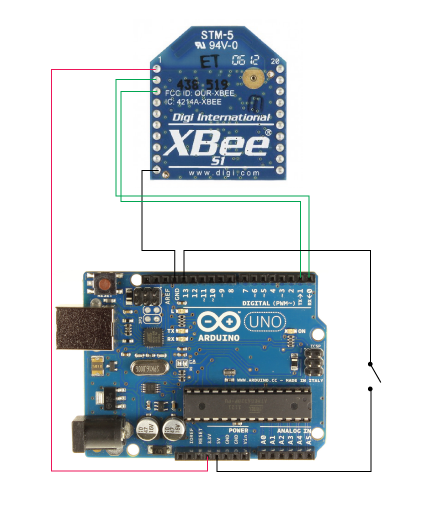

# Klasse 1, Hallo Xbee

## Die Xbee Series 1 Antenne

* Voltzahl = 3.3v
* 8x Digitaleingänge
* 6x Analogeingänge
* 1x UART (Serial)
* 2x PWM (Pulse Wave Modulation)

## Experiment 1

## Ziel
Die Erstellung eines Xbee-Netzwerks zwischen zwei Computer.

## Materialien
* 2x [Xbee S1 Antenne](https://www.sparkfun.com/products/11215)
* 2x [Xbee Explorer USB](https://www.sparkfun.com/products/9819) 
* 2x Computer mit USB Eingang

## USB + Xbee auf MacOX

Für die Xbee-Einstellung CoolTerm (http://freeware.the-meiers.org/) wird sehr häufig verwendet.

## CoolTerm Einstellungen

### Options

## Der Erste Kontakt mit Xbee

Schreiben Sie "+++" und warten Sie auf die Antwort.

Sie bekommen normalerweise "OK" von Xbee 1-3 Sekunden später.

## AT Commands

Die folgende Liste zeigt alle wichtige AT Commands, die Xbee-Antennen verstehen.

[at command](at_cmd.md)

### Abfrage
Schreiben Sie "atmy" und drücken Sie die Eingabetaste.

Die Identifikationsnummer dieser Antenne lautet "0".

### Änderung
Schreiben Sie "atmy 0" und drücken Sie die Eingebetaste.

Dann Fragen Sie die ID-Nr wieder. Die ID-Nr wurde geändert.

### Speicherung
Mit "atwr" kann man die Einstelung speichern.

Alle Einstellung wird gelöscht, wenn man keinen "atwr" command ausführt.

## Xbee Netzwerk

Jede Xbee Antenne hat drei Nummern.

* PAN-ID (PAN = Personal Area Network)
* Source Address
* Destination Address

### PAN ID
Wenn man zwei Anttenen kommunizieren lassen möchte, muss man den beiden Antenne gleiche Pan-ID geben.

#### Einstelung der Pan-ID
Mit ATID command kann man Pan-ID eingeben.

### Source Adress
Dies ist die Adresse der Antenne. zwischen 0-65535. Zwei unterschiedliche Antennen in einem Netzwerk dürfen nicht identische Nummer haben.

#### Einstelung der Source-Adress
Mit ATMY command kann man Source Adress eingeben.

### Destination Adress
Dies ist die Adresse des Empfängers. Die Nummer muss zwischen 0-65535 sein. Zwei unterschiedliche Antennen in einem Netzwerk dürfen nicht identische Nummer haben.

#### Einstelung der Destination-Adress
Mit atdl command kann man Destination-Adress eingeben.

Einstelung der zwei Antennen

|     |Xbee A       | Xbee B       | 
|-----|------------ | -------------| 
|atid |5000         | 5000         | 
|atmy |1            | 2            | 
|atdl |2            | 1            | 

### CoolTerm -> CoolTerm

---------------------
# Experiment 2: Broadcasting

Ein Xbee kann an meherere Antennen nachricht schicken.

## Ziel

|     |Xbee A       | Xbee B       | Xbee C       |
|-----|------------ | -------------| -------------| 
|atid |5000         | 5000         | 5000         | 
|atmy |1            | 2            | 3            |
|atdl |FFFF         | 1            | 1            |

FFFF bedeutet "an alle Antennen im Netzwerk"

---------------------
# Experiment 3: Serial-Objekt

## Ziel
Von Max Serial Messages an den zweiten Computer senden.

### Max -> Coolterm

Max Patch

Coolterm

### Max -> Max

### Was ist Baudrate?

baud rate bedeutet die Geschwindigkeit. Baud ist einstellbar mit atbd Command. 
Vorsicht: Wir benutzen immer 9600 baurd in diesem Kurs.

---------------------
# Experiment 4: XBee + Arduino + LED 

## Ziel
Wir blinken eine LED, die 10 meter entfernt vom Computer, mit Max/MSP toggle GUI.

### Materialien

* 1x Breadboard
* 2x Xbee S1 Antenne 
* 1x Arduino Uno
* 1x LED
* 1x 550 Ohm Widerstand
* 1x [Xbee Explorer USB](https://www.sparkfun.com/products/9819)
* 1x [Xbee Breakout](https://www.sparkfun.com/products/8276)
* 2x [2mm header-female](https://www.sparkfun.com/products/8272)
* 2x [0,1inch header-male](https://www.sparkfun.com/products/10527)

#### Warum brauchen wir Breakout?

Der Abstand zwischen Löcher auf einem Breadboard ist 0,1 inch. Aber der Abstand zwsichen Pins von Xbee ist 2mm.

### Arduino Programm

	int led = 13;

	void setup() {
		Serial.begin(9600); 
 		 pinMode(led, OUTPUT);     
	}

	void loop() {
 		 int input;
 		 if (Serial.available() > 0) {
  		    input = Serial.read();
			if(input > 50){
    	    	digitalWrite(led, HIGH);
    	  	}else{
    	   	 digitalWrite(led, LOW);
     	 	}
  		}
	}

---------------------
# Experiment 5: XBee + Arduino + Knopf 

##Ziel

### Arduino Programm

Aller 5 msek. schickt das folgende Arduino-Programm den Zustand des Knopfs . 

	int button = 13;

	void setup() {
 		Serial.begin(9600); 
  		pinMode(button, INPUT);  
	}

	void loop() {
  		int input = digitalRead(button);
  		Serial.print(input);  
  		delay(5);
	}

### Referenz

http://examples.digi.com/sensors/802-15-4-digital-input-with-a-button/

