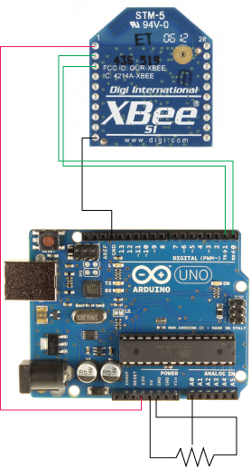
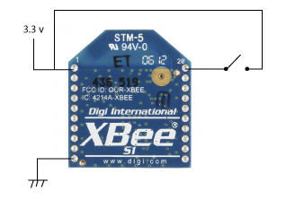
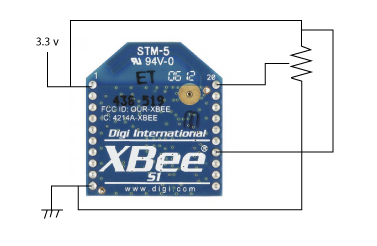

# Klasse 2, Goodbye Arduino

<<<<<<< HEAD
# Experiment 6: XBee + Arduino + POT

---
	int sensor = A0;

	void setup() {
  		Serial.begin(9600); 
	}

	void loop() {
  		int sensorValue = analogRead(sensor);
		  Serial.write(sensorValue/4);  
		  delay(50);
	}

---
=======

---------------------
# Experiment 6: XBee + Arduino + Infrarotsensor

>>>>>>> 644f6572180e7ce36fe4e298aa342652515263b8
### Modi
Es gibt zwei Modi

* AT Modus
* API Modus

Mit AT Mode kann man zwei Xbee-Antennen als Absender und Empfänger der UART-Nachrichten verwenden.
Der Modus ist nutzlich, wenn man ein Arduino und Computer kombinieren und das Arduino weit weg von dem Computer positionieren möchte.
<<<<<<< HEAD

---
# Experiment 7: XBee + Knopf 
###Moduswechsel

ATAP = 0 … AT Modus
ATAP = 2 … API Modus

|     |Xbee A       |
|-----|------------ |
|atid |5000         |
|atmy |1            |
|atdl |2            |
|atap |2            |
|atd0 |1            |
|atd1 |0            |
|atd2 |0            |
|atd3 |0            |
|atd4 |0            |
|atd5 |0            |
|atd6 |0            |
|atd7 |0            |
|atd8 |0            |
|atir |30           |

Wir benutzen nur Digital 0 als Digitaleingang.
Der Wert von ATIR definiert das Intervall der Konvertierungen.

Xbee Antenne bekommen eine Liste wie folgende: 
126 0 10 131 0 1 36 0 1 0 1 0 1 81 

|Byte|Zahl|Funktion          |Bedeutung       |
|----|----|------------------|----------------|
|1   |126 |Start Delimiter   |                |
|2   |0   |Length (MSB)      |                |
|3   |10  |Length (LSB)      |16 bytes        |
|4   |131 |API Indentifier   |RX Packet:16-bit|
|5   |0   |Source Address    |                |
|6   |1   |Source Address    |Source address=1|
|7   |36  |Signal Strength   |                |
|8   |0   |Options           |No Options      |
|9   |1   |Number of Samples |1 sample        |
|10  |0   |Activated Ports   |                |
|11  |1   |Activated Ports   |D0 activated    |
|12  |0   |Data MSB          |                | 
|13  |1   |Data MSB          |D0 HIGH         |
|14  |84  |Check Sum         |                |

Check Sum:
131+0+1+36+0+1+0+1+0+1 = 171
255 - 171 = 84

ATAP 1 = API MODE
ATAP 2 = API MODE (escape)

in API MODE (escape)
Wenn die Daten 126 beinhaltet, ersetzt Xbee sie durch 0.
126 ---> 0

---
# Experiment 8: XBee + POT 

126 0 10 131 0 1 29 0 1 2 0 0 29 62

|Byte|Zahl|Funktion          |Bedeutung       |
|----|----|------------------|----------------|
|1   |126 |Start Delimiter   |                |
|2   |0   |Length (MSB)      |                |
|3   |10  |Length (LSB)      |16 bytes        |
|4   |131 |API Indentifier   |RX Packet:16-bit|
|5   |0   |Source Address    |                |
|6   |1   |Source Address    |Source address=1|
|7   |29  |Signal Strength   |                |
|8   |0   |Options           |No Options      |
|9   |1   |Number of Samples |1 sample        |
|10  |2   |Activated Ports   |A0 activated    |
|11  |0   |Activated Ports   |                |
|12  |0   |Analog MSB        |                | 
|13  |29  |Analog LSB        |                |
|14  |62  |Check Sum         |                |

---
# Experiment 9: XBee + POT 

---
# Experiment 10

---
=======
>>>>>>> 644f6572180e7ce36fe4e298aa342652515263b8
