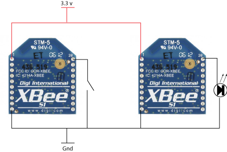

# Klasse 3, Weitere Funktionen

# Experiment 10: I/O Passing (Digital)

### Ziel

### Stromkreis

### Absender/Empfänger

|     |Absender |Empfänger|
|-----|---------|---------|
|atid |xxx      |xxx      |
|atmy |1        |2        |
|atdl |2        |1        |
|atap |0        |0        |
|atd0 |3(input) |5(output)|
|atic |1        |0        |
|atiu |1        |0        |
|atia |0        |1        |
|atir |25       |         |

xxx.. deine Lieblingsnummer 

- ATIC ... IO Change Detect
- ATIA ... IO Input Address
- ATIU ... IO Output Enable

# Mit Akku 3.3v 
Wenn man ohne Arduino die Antenne benutzen möchte, muss man 3.3v Strom irgendwie besorgen.

## Netzteil

[Conrad](http://www.conrad.de/ce/de/product/513272/)
- 31 euro

## Akku

9v Akku + Regler LM1117

