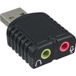
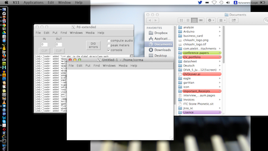

# Klasse 3, Hallo Raspberry Pi

## RaspBerry Pi
Der Raspberry Pi ist ein kreditkartengroßer Einplatinencomputer, der von der Raspberry Pi Foundation entwickelt wurde. 

### Spezifikationen

### Webseite
[Raspberry Pi Webseite](http://www.raspberrypi.org/)

### Foto

### Eigenschaften

- Günstig ca' 35 $
- FBAS Anschluss, Verbindbar mit Fernseher
- HDMI Anschluss, Verbindbar mit Bildschirm, Beamer usw.
- Audio Ausgänge (Klangqualität ist nicht so gut)
- 2x USB, (Arduino, Audio I/F usw.)
- 1x Ethernet

### Beispielprojekte mit RaspPi

### Musikalische Anwendungen

#### Miller Puckette Raspberry Pi + Pd demo

-[Miller Puckette - Pd auf RaspBerry Pi 1](http://vimeo.com/52259196)
-[Miller Puckette - Pd auf RaspBerry Pi 2](http://vimeo.com/52265243)

#### DIY-Guitar Effect mit Raspberry Pi 

-[Raspberry Pi Guitar Effect](http://www.youtube.com/watch?v=bLcW70tcBX8)

#### Stanford Universität 

-[Raspberry Pi Projekte](https://ccrma.stanford.edu/~eberdahl/Satellite/)

##### Computergraphik mit RaspPi

-[OpenGLES auf Pi](http://www.youtube.com/watch?v=82PHzktgSNA)

### Benchmark

- [Mac Book Pro auf Geekbench](http://http://browser.primatelabs.com/geekbench2/search?utf8=%E2%9C%93&q=Macbook+pro+15-inch)
- [Raspberry Pi auf Geekbench](http://browser.primatelabs.com/geekbench2/search?dir=desc&q=BCM2708&sort=score)

Mein Mac ist ca' 28 mal schneller als RaspPi.

[Rasoberry Pi Benchmark Webseite](http://www.roylongbottom.org.uk/Raspberry%20Pi%20Benchmarks.htm)

### Änliche Produkte

- [Beagleboard](http://beagleboard.org/)
- [Arduino Tre](http://arduino.cc/en/Main/ArduinoBoardTre)

### Klangqualität

Die Klangqualität des on-board DAC ist nicht so gut und es gibt keine audio EINGÄNGE auf der Platine aber man kann mit USB- Audio Adapter dieses Problem vermeiden. 

- [Sound Blaster Play](http://www.amazon.de/gp/product/B0028RZ23I/ref=oh_details_o06_s00_i00?ie=UTF8&psc=1)
- [InLine 33051D](http://www.amazon.de/InLine-33051D-Mini-Audio-Adapter/dp/B004ZQKYZG/ref=sr_1_2?s=computers&ie=UTF8&qid=1383235442&sr=1-2&keywords=usb+audio+adapter)

## Betriebssysteme für RaspPi

### Verschiedene Linux OS

Man kann  vershiedene OS auf RaspPi laufen lassen
- Raspbian (das offizielle Betriebssytem für RaspPi)
- Ubntu
- RiscOS

### Satellite CCRMA
CCRMA = Center for Computer Reserach in Music and Acoustic, an der Stanford Universtität

Satellite CCRMA ist ein RaspPi-OS + Software-bundle für Musiker und Medienkünstler. Die folgende Software sind schon installiert.

- Pure Data
- Arduino 
- Audacity
- ChucK
- SuperCollider
- Jack

[Webseite](https://ccrma.stanford.edu/~eberdahl/Satellite/)

### Probleme mit Satellite CCRMA?

[Google Group von Satellites CCRMA](https://groups.google.com/forum/#!forum/satelliteccrma)

## Herunterladen und Installation

- [Binary](https://ccrma.stanford.edu/~eberdahl/Satellite/SatelliteCCRMA_Rpi_v0.98.dd.zip)
- [Anweisung](https://ccrma.stanford.edu/wiki/Satellite_CCRMA_First_Steps)

## Remote Desktop

Der RaspPi könnte wie ein Desktop-Computer benutzen werden aber ein Bildschirm (oder Fernseher) und eine Tastatur (+ ein Maus) sind nötig.

Remote Desktop ermöglicht uns mit dem Bildschirm und der Tastatur von Mac den RaspPi zu steuern.

### XQuartz

Remote Desktop braucht "XQuartz", um GUI von RaspPi auf dem Bildschirm von Mac anzuzeigen.

[XQuartz](http://xquartz.macosforge.org/landing/)

## Einschaltung

Es gibt keinen Schalter auf der Platine und keine Anschluss für ein Netzteil; ein USB-Kabel (Micro USB) Liefert Strom zum RaspPi.

#### Direkt von Mac

#### USB-Hub mit Netzteil

#### Netzteil

#### GPIO Header
 z.B. mit Akku.

## SSH Verbindung

### Mac Netzwerkeinstellung
- IP Address: 192.168.105.105
- Subnet Mask: 255.255.255.0

### Ping

	> ping 192.168.105.106 (192.168.105.106): 56 data bytes
	> 64 bytes from 192.168.105.106: icmp_seq=0 ttl=64 time=1.604 ms
	> 64 bytes from 192.168.105.106: icmp_seq=1 ttl=64 time=0.767 ms
	> 64 bytes from 192.168.105.106: icmp_seq=2 ttl=64 time=0.977 ms
	> 64 bytes from 192.168.105.106: icmp_seq=3 ttl=64 time=0.890 ms
	> 64 bytes from 192.168.105.106: icmp_seq=4 ttl=64 time=0.743 ms

### SSH Command auf Terminal

	> ssh -XY ccrma@192.168.105.106
	> passwd: temppwd

## Unix-Befehle

[Unix-Befehle für Anfänger](http://nafoku.de/t/unix.htm)

### Pure Data
	> pd &
	
### Audacity
	> audacity &

### Arduino
	> arduino &	

## Klangsynthese mit Pd

[Programmierung Elektronischer Musik in Pd](http://www.pd-tutorial.com/german/index.html)	 von Johannes Kreidler

