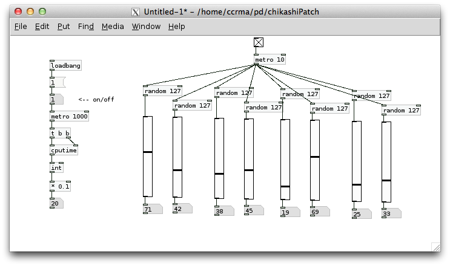

# Klasse 5, Raspberry. Hack & Tricks

## Wichtigste Unix Befehle

- ls
- cd
- pwd
- pd &
- top
- sudo halt
- sudo reboot

### Neue Befehle

- mv  (umbenennen)
- rm   (löschen)
- more  (text lesen)
- nano  (text bearbeiten)
- mkdir  (Ordner anlegen)
- lsusb  (alle usb Geräte anzeigen)

### Audio Utilities
- aplay (Klangdatei abspielen mit ALSA)
- alsamixer (Einstellung Klang)

## Wildcard

- \* = alle Dateien
- *.pdf = alle PDF Dateien
- *.pd = alle Pd Dateien

Man kann diese Wildcards und Befehle kombinieren. z.B.

- rm *.pdf (alle PDF Dateien im Ordner löschen)

## Experiment 12: Der autonome Modus

In dem autonomen Modus: Der Raspberry Pi startet automatisch ein Pd Patch, wenn es eingeschaltet wird. Nutlich für Klanginstallation oder selbstgebaute Instrumente.

### Schritt 1
Programm ein Patch. 

Mit Message box "; pd dsp1" und "loadbang" kann man DSP automatisch starten. Speiche das Patch unter /home/ccrma/on-startup.
Der Name des Patches muss "experiment12.pd" sein.

### Schritt 2

Wenn der Pi eingeschalltet wird, sucht Satellite CCRMA(SatC) eine Datei unter /home/ccrma/on-startup/. Wenn SatC dort eine Datei,  "load_default_patch" findet, führt SatC sie aus.

	>cd 
	>cd on-startup
	>nano load_default_patch_disabled 

nano ist ein Text-Editor. Mit nano ändere die letzte Zeile der Datei ab.

### Schritt 3

	>mv load_default_patch_disabled load_default_patch

mit mv-Befehl kann man den Name einer Datei ändern.

### Schritt 4

	>sudo reboot

den Rechner neustarten.

### Schritt 5

	>stop-default

den Pd-Prozess beenden.

## Experiment 13: Pd Programmierungstechnik für RaspPi

### switch~ objekt
Damit kann man die Rechnung ein Sub-Patches ein/ausschalten. (ähnlich wie mute~ oder poly~ in Max)

### line objekt
Die zweite Argument ist das Intervall der Ausgabe. Je weniger das Intervall ist, desto mehr Ressource braucht die CPU.

### expr~ und fexpr~ Objekte vermeiden

expr~ und fexpr~ produzieren manchmal sehr hohe CPU-Spikes.

### Funcy GUI = Ressourcenverwendung

Wish (Graphische Tool Kit von Pd) konsumieren auch viele Ressource.
	

### Pure Data ohne Graphische Oberfläche

mit -nogui Option kann man pd ohne GUI benutzen. weniger CPU.

	> pd -nogui myPatch.pd

	
## Experiment 14: Datenübertragung zwischen Mac und Pi

### scp (secure copy) command
	
z.B.: Ich möchte mein Patch "myPatch.pd" auf dem Schreibtiesch auf den Pi übertragen.

Auf Mac:

	>cd
	>cd Desktop
	>scp myPatch.pd ccrma@192.168.105.106:~/
	
~/ bedeutet "unter Home Ordner"

### mehrere Dateien auf einmal übertragen

z.B.: Ich möchte drei .wav Dateien auf einmal auf den Pi übertragen.

Auf Mac:

	> scp *.wav ccrma@192.168.105.106:~/
	
### .zip auf Pi entpacken

Auf Mac:
	
	> scp myProject.zip ccrma@192.168.105.106:~/
	
Auf Pi:
	
	> unzip myProject.zip

## Experiment 15: USB Audio Interface

Normalerweise erkennt Pd automatisch USB Audio Interfaces.

Media > Audio Settings

## Experiment 16: OSC kommunikation zwischen  Pi+Pd und Mac+Max

Pi+Pd (Sender)

Mac+Max (Empfänger)

---
Mac+Max (Sender)

Pi+Pd (Empfänger)

---

Dieses OSC Netz ermöglicht z.B. mehrere Pi mit einem Mac zu steuern.

[USB WLAN Adapter für RaspPi](http://elinux.org/RPi_USB_Wi-Fi_Adapters)

### Änderung der IP Adresse

temporal

	>sudo ifconfig eth0 192.168.105.107

permanent

	>sudo nano /etc/network/interfaces
	

	>sudo reboot
	
	>ssh -XY ccrma@192.168.105.107
	
## Experiment 17: MIDI Syntheizer

### MIDI Kbd + Pi + Pd 

Pd und Raspberry Pi normalerweise erkennt Genelic USB MIDI Keyboard ohne Triber

	> lsusb
	Bus 001 Device 002: ID 0424:9512 Standard Microsystems Corp. 
	Bus 001 Device 001: ID 1d6b:0002 Linux Foundation 2.0 root hub
	Bus 001 Device 003: ID 0424:ec00 Standard Microsystems Corp. 
	Bus 001 Device 006: ID 09e8:0076 AKAI  Professional M.I. Corp. LPK25 MIDI Keyboard

Einstellung: Media > MIDI Settings...

