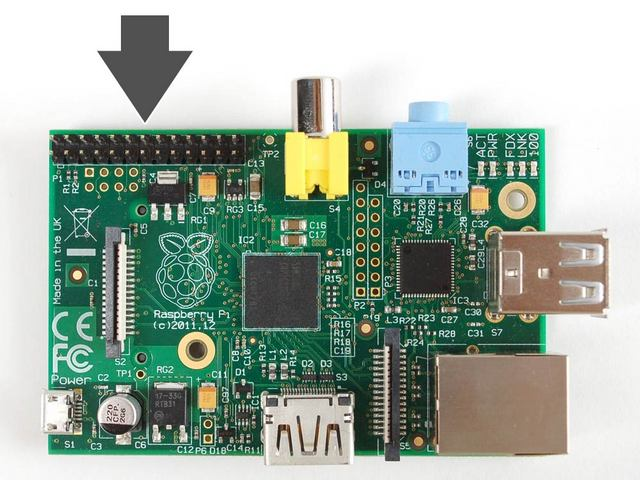
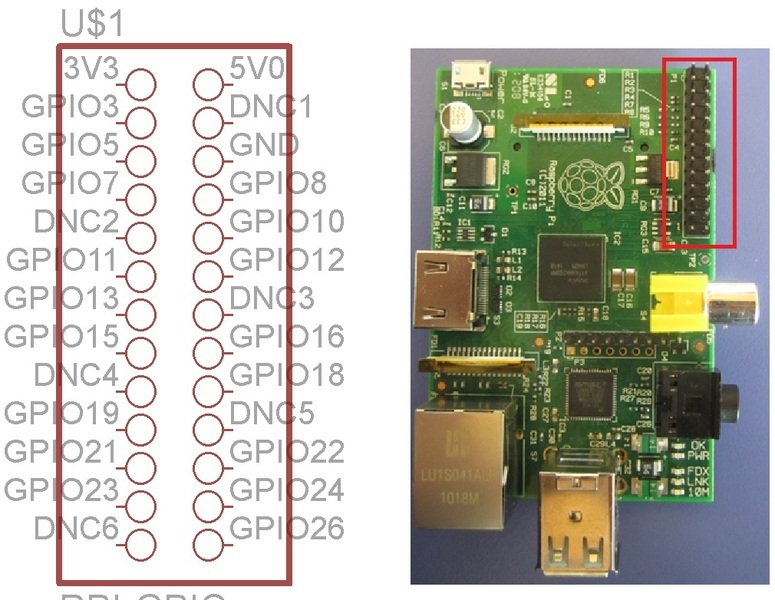

# Klasse 6, Pi, Xbee	und Arduino

## Experiment 14: Arduino + Pd auf Raspberry Pi

### Arduino IDE
	> arduino

### Beispiel Program

LED blinken und gleichzeitig "100" and Pd-Patch schicken.

### Comport object = Empfänger in Pd
Mit comport Objekt kann ein Pd-patch alle Messages von Arduino erhalten.

## Experiment 15: GPIO von RaspPi

### GPIO 

GPIO = General Purpose Input Output (http://de.wikipedia.org/wiki/Allzweckeingabe/-ausgabe)

### Wo steht GPIO auf RaspPi?

### Wofür brauchen wir GPIO?

Mit GPIO kann man RaspPi als Arduino benutzen. Diese Pins ermöglichen uns LEDs zu blinken, Servos zu steuern, mit externe ADCs zu kommunizieren usw. d.h. man kann ohne Arduino ein musikalisches Instrument entwicklen.

### Pins

GPIO auf Pi besteht aus 26 männliche Pins. Die Funktionen jedes Pins ist folgendes:

### mänliche Pins

Leider sind alle Pins mänlich. wir benötigen [Female-Male Jumper Wire ](https://www.sparkfun.com/products/9140), um GPIO mit einer Steckplatine zu experimentieren.

Ein Beispiel mit Jumper Wire.

### Experimentierplatine

Es gibt ein Paar Experimentplatine für GPIO-Entwickler.

[gehtboard](https://www.sparkfun.com/products/11773)

Features:

- Plugs directly onto Raspberry Pi GPIO socket
- Motor controller, capable controlling a motor bi-directionally, delivering 18V and 2A maximum
- Dual-channel D-to-A converter, 8-bit
- Dual-channel A-to-D converter, 10-bit
- Onboard Atmel ATmega328 MCU for running off-board programs which are written, compiled and uploaded to Gertboard from Raspberry Pi
- 6 x open collector outputs
- 12 x LED indicators
- 3 x momentary push switches
- 10 x strap cables included
- 18 x jumpers included

### Programmierung

[gpio_programming](http://elinux.org/RPi_Low-level_peripherals)

#### Wiring Pi

[Wiring Pi](https://projects.drogon.net/raspberry-pi/wiringpi/)

	WiringPi is an Arduino wiring-like library written in C and released under the GNU LGPLv3 license which is usable from C and C++ and many other languages with suitable wrappers (See below)

##### Installation

###### Herunterladen
Lade das neueste Snapshot runter.
[Wiring Pi Github Repo](https://git.drogon.net/?p=wiringPi;a=summary)

###### Kopie

Mit "scp" Befehl wiringPi-f18c8f7.tar.gz auf dem Pi kopieren.

	> scp wiringPi-f18c8f7.tar.gz ccrma@192.168.105.106:~/ 

###### SSH verbindung

Durch SSH auf den Pi einloggen.

	> ssh -XY ccrma@192.168.105.106
	
###### Dekompression

Mit "tar" die .tar.gz Datei dekomprimieren

	> tar xfv wiringPi-f18c8f7.tar.gz
	
###### Kompilation 

	> cd wiringPi-f18c8f7
	> ls
	
"build" ist ein Schell Script, das die kompilation automatisiert. Führe es aus.

	> ./build
	

##### Test

###### Quellcode
 
LED blinken ohne Arduino oder Xbee

	#include <wiringPi.h>
	#define	LED 11

	int main (void)
	{
		wiringPiSetup () ;
		pinMode (LED, OUTPUT) ;

		for (;;)
  		{
    		digitalWrite (LED, HIGH) ;	// On
		    delay (200) ;		// mS
		    digitalWrite (LED, LOW) ;	// Off
		    delay (200) ;
		 }
	  return 0 ;
	}

###### Pin-Nummer in Wiring Pi

[Pins Nummer](https://projects.drogon.net/raspberry-pi/wiringpi/pins/)

###### Kompilation

	> gcc -o blink blink.c -lwiringPi

- gcc ... gnu compiler 
- -o blink ... Name des Programs = blink
- blink.c ... Quellcode
- -lwiringPi ... mit Bibliothek wiringPi

###### Stromkreis

SEI VORSICHTIG!! Falsche Verbindung kann die Platine beschädigen!

## Experiment 16: Wiring Pi

### gpio Befehl

gpio ist ein Dienstprogramm, das mit WiringPi entwickelt wurde. gpio akzeptiert viele Optionen. der folgende Befehl lässt das Programm die Liste der Optionen anzuzeigen.

	> sudo gpio -h

#### Test
Alle Pins checken.

	> sudo gpio readall
	

#### Pin-Kontrol

	> sudo gpio reset
	> sudo gpio mode 11 out

einschalten:

	> sudo gpio write 11 1

ausschalten:

	> sudo gpio write 11 0
	

GPIO Pins können durch Unix-befehle kontrollierbar.

#### Shell Script

Man kann blinkende LED auch mit einem Shell Script realisieren.

blink.sh

	#!/bin/sh
	gpio reset
	sleep 0.5
	gpio mode 11 out
	while true; do
	  gpio write 11 1
	  sleep 0.2
	  gpio write 11 0
	  sleep 0.2
	done

Mit sh Befehl das Script ausführen

	> sh blink.sh
	
## Experiment 17: Pd steurt GPIO

### Blinkende LED auf Pd

Es gibt "schell" Objekt in Pd. Damit kann man Unix-Befehle auf Pd-Patch ausführen.

### gpio read

Man kann mit "gpio read 11" Pin-Status checken. Interene Pull-up ist auch möglich durch "gpio mode 11 up".

## Experiment 18: ADC und RaspPi

RaspPi hat keine ADC (Analog to Digital Converter) aber es gibt Pins für SPI (Serial Peripheral Interface). Mit SPI kann RaspPi mit einem oder mehreren externen ADCs komunizieren.

### ADC Beispiele

- ADC0831 (8bit 1ch)
- ADC0838 (8bit 8ch)
- Max186 (12bit 8ch)
 
 ADC0838
 
 
### Aktivierung 
	
SPI Funktion ist am Anfang deaktiviert. aktiviere mit dem folgenden Befehl. 
	
	> gpio load spi

### Verbindung

### Quellcode

PIN 12 = MOSI

	#include <wiringPi.h>
	#include <wiringPiSPI.h>
	#include <stdio.h>
	#include <unistd.h>

	int main(void){
		int spiCh = 1;
		unsigned char data[2];
		int spi = wiringPiSPISetup(spiCh, 500000);

		wiringPiSetup();
		pinMode(12, OUTPUT);
		digitalWrite(12, HIGH);
		if(spi == -1){
			printf("cannot initialize\n");
			return 1;
		}
	
		for(;;){
			int res;
			unsigned char value;
			digitalWrite(12, LOW);
			res = wiringPiSPIDataRW(spiCh, data, 2);
			digitalWrite(12, HIGH);

			value = (data[0] << 2) + (data[1] >> 6);
			printf("data:%d\n", value);
			usleep(10000);
		}
		return 0;
	}

[source code](gpiodev.zip)

### Kompilation

	> gcc -o spi spi.c -lwiringPi
