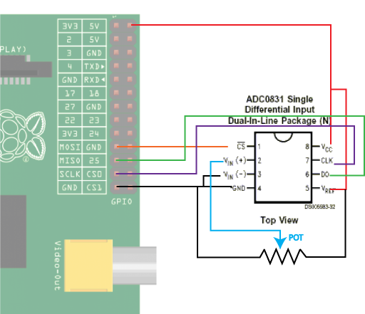

# Klasse 7, RaspPi, Servo und ADC/DAC 

## Neue Technologie 2014

- [Intel Edison](http://www.wired.co.uk/news/archive/2014-01/07/intel-edison)

- [Arduino Tre](http://arduino.cc/en/Main/ArduinoBoardTre)

- [3D Acoustic Levitation](http://www.youtube.com/watch?v=odJxJRAxdFU)

## Nicht so neu aber gut zu wissen

- [E-ink](http://www.youtube.com/watch?v=vTBp0Z5GPeI) schneller und eleganter als live-soldering. Eine Zukunft von Live-Coding?

- [E-Sewing](http://lilypadarduino.org)

## Chikashis Hausaufgaben

### 1.Flex Sensor

[flex sensor](https://www.sparkfun.com/products/8606)

### 2.Servo

Ein Servo  bezeichnet in der Elektrotechnik einen Verbund aus Ansteuerungs- und Antriebseinheit. Dies kann beispielsweise ein Elektromotor samt seiner Steuerelektronik sein. Im allgemeinen Sprachgebrauch werden Servos häufig mit Servomotoren gleichgesetzt.

[How it works Servo Motor](http://www.jameco.com/Jameco/workshop/howitworks/how-servo-motors-work.html)

#### Spezifikation eines Servo

- Betriebsgeschwindigkeit: Die Geschwindigkeit eines Servos (z.B 0.14 sec/60°)
- Torque: Die Kraft eines Servos (z.B. 15kg·cm)

#### Laden

- [Conrad.ch](http://www.conrad.ch/) 892 Produkte

#### PWM

PWM = Pulse Wave Modulation.
Mit PWM kann man einen analogen Servomotor steuern.

#### Arduino + PWM

Arduino hat Funktionen für PWM - AnalogWrite.

[Arduino Reference AnalogWrite](http://arduino.cc/en/Reference/AnalogWrite)

#### Raspberry Pi + Servo

Wiring Pi hat PWM Funktionen.
[Wiring Pi Software-PWM](https://projects.drogon.net/raspberry-pi/wiringpi/software-pwm-library/)

	#include <wiringPi.h>
	#include <stdio.h>
	int main(void){

		unsigned int degree;
		wiringPiSetup();
		pinMode(1, PWM_OUTPUT); // 6 th pin outside
		pwmSetMode(PWM_MODE_MS);
		pwmSetRange(1024);
		for(;;){
			scanf("%u", &degree);
			printf("degree:%u\n", degree);
			pwmWrite(1, degree);
		}
	}

### 3.ADC

Analog to Digital Converter.

#### ADC Beispiele

- ADC0831 (8bit 1ch)
- ADC0838 (8bit 8ch)
- Max186 (12bit 8ch)
 
 ADC0838
 
 
#### Aktivierung 
	
SPI Funktion ist am Anfang deaktiviert. aktiviere mit dem folgenden Befehl. 
	
	> gpio load spi

#### Verbindung

#### Quellcode

PIN 12 = MOSI
spi.c

	#include <wiringPi.h>
	#include <wiringPiSPI.h>
	#include <stdio.h>
	#include <unistd.h>

	int main(void){
		int spiCh = 1;
		unsigned char data[2];
		int spi = wiringPiSPISetup(spiCh, 500000);

		wiringPiSetup();
		pinMode(12, OUTPUT);
		digitalWrite(12, HIGH);
		if(spi == -1){
			printf("cannot initialize\n");
			return 1;
		}
	
		for(;;){
			int res;
			unsigned char value;
			digitalWrite(12, LOW);
			res = wiringPiSPIDataRW(spiCh, data, 2);
			digitalWrite(12, HIGH);

			value = (data[0] << 2) + (data[1] >> 6);
			printf("data:%d\n", value);
			usleep(10000);
		}
		return 0;
	}

[source code](gpiodev.zip)

#### Kompilation

	> gcc -o spi spi.c -lwiringPi

#### GPIO in Pure Data

[Externals](https://github.com/chikashimiyama/Basel_Hardware/blob/master/pddev.tar.gz)

