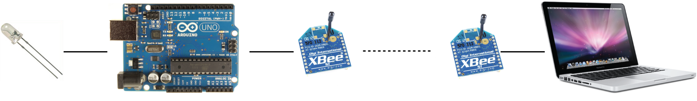
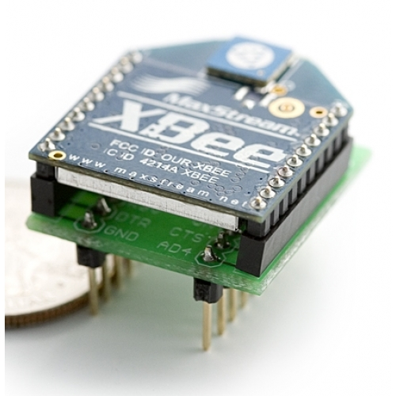

## AT Mode

Es gitb zwei Modi:
- AT Modus
- API Modus

Mit AT Mode kann man zwei Xbee-Antennen als Absender und Empfänger der UART-Nachrichten verwenden.
Der Modus ist nutzlich, wenn man ein Arduino und Computer kombinieren und das Arduino weit weg von dem Computer positionieren möchte.

### Ziel
Wir blinken eine LED, die 10 meter entfernt vom Computer, mit Max/MSP toggle GUI.

### Materialien

* 1x Breadboard
* 2x Xbee S1 Antenne 
* 1x Arduino Uno
* 1x LED
* 1x 550 Ohm Widerstand
* 1x Xbee Explorer USB (https://www.sparkfun.com/products/9819)
* 1x Xbee Breakout (https://www.sparkfun.com/products/8276)
* 2x 2mm header female (https://www.sparkfun.com/products/8272)
* 2x 0,1inch header male (https://www.sparkfun.com/products/10527)

### Warum brauchen wir Breakout?

Der Abstand zwischen Löcher auf einem Breadboard ist 0,1 inch. Aber der Abstand zwsichen Pins von Xbee ist 2mm.

