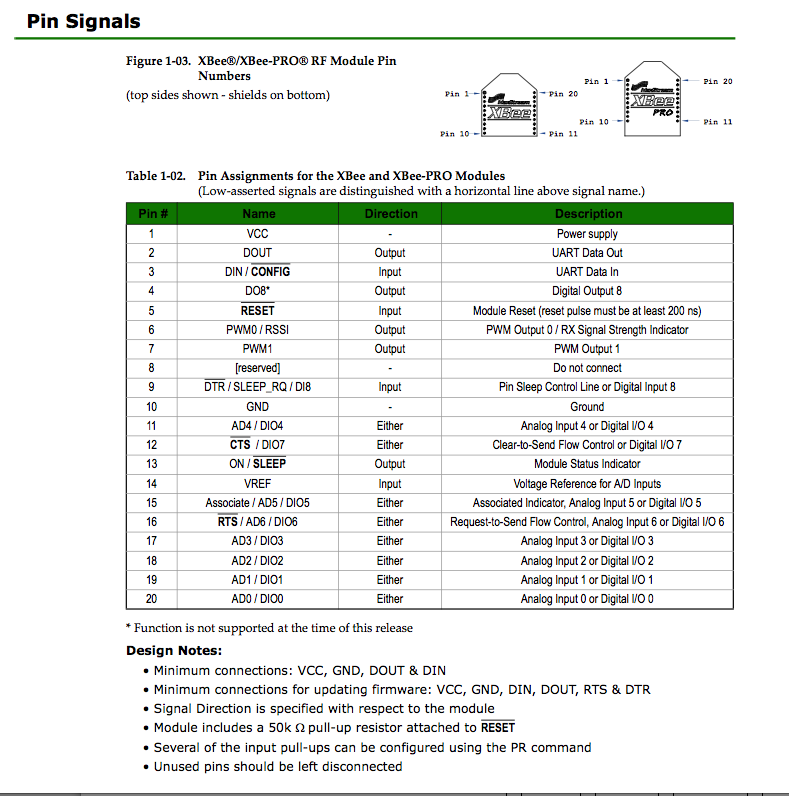

### Xbee Types

#### Cool Term
[Cool Site Website](http://freeware.the-meiers.org/)

#### Xbee Series 1 (XBee IEEE 802.15.4)

Appropriate for one to one or one to many communication.
Easy to setup.

##### Xbee Series ZB 

Appropriate for more complex and larger network.
It is possible to route and forward messages.

### Xbee pins

### Terminology
##### PAN = Personal Area Network (ATID)
XBee Antenna only talk to Xbee antenna which has same PAN
You can specify PAN of each antenna by your self

##### SOURCE ADRESS 
Each Xbee antenna has own source address (ATMY)

##### DESTINATION ADRESS
The address (ATMY) of target xbee antenna.
An antenna send message to a XBee antenna with this destination address

### AT/API Operation

#### AT Operation

forwards all received UART messages to another Xbee antenna

#### API Operation

works like Arduino
##### API packet

0x7E (hex) = 7*16 + 14 = 126 (dec)

#### IO Format

#### 16 bit packet

